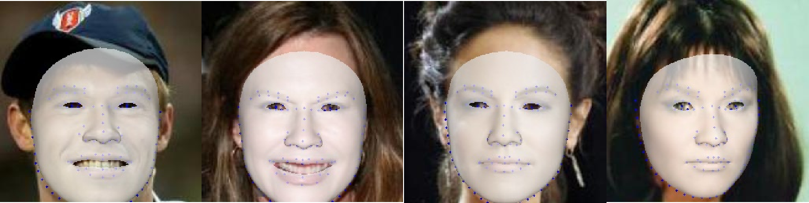

# Towards Real Time Face Reconstruction

## Abstract
Given a monocular face image as input, 3D face geometry reconstruction aims to recover a corresponding 3D face mesh. Recently, both optimization-based and learning-based face reconstruction methods have taken advantage of the emerging differentiable renderer and shown promising results. Optimization-based methods achieve impressive reconstruction results with high fidelity, but the time required to perform the optimization is unacceptable in real-time circumstance. On the other hand, efficient deep neural networks present promising capability to achieve plausible reconstruction results while consuming much less time. However, due to the lack of high-fidelity data, previous deep neural networks fail to achieve competitive results as the optimization-based counterparts. In this project, we propose to distill the knowledge of the optimization-based face reconstruction methods into an efficient convolutional neural network for real time face reconstruction. Specifically, we first capture a multi-view face dataset with a 30-camera stage and reconstruct the face meshes Shape From Motion (SFM) to obtain the 3D Morphable Models (3DMM) bases. Then we apple the optimization-based method on a large in-the-wild dataset to create pseudo labels. Finally, we explore a large model and an efficient tiny neural network, which are trained in a novel knowledge distillation manner. Equipped with the pseudo labels and the novel knowledge distillation method, the tiny neural network achieves even better performance then the large network, while consuming only 5.5 mili-second for each frame. Extensive experiments have been conducted to demonstrate the effectiveness of the proposed framework.

## Framework

## Results

## License

Model details and custom CUDA kernel codes are from official repostiories: https://github.com/NVlabs/stylegan2

Codes for Learned Perceptual Image Patch Similarity, LPIPS came from https://github.com/richzhang/PerceptualSimilarity

To match FID scores more closely to tensorflow official implementations, I have used FID Inception V3 implementations in https://github.com/mseitzer/pytorch-fid

The work is built on the implementation of stylegan2 with Pytorch (https://github.com/rosinality/stylegan2-pytorch.git)
